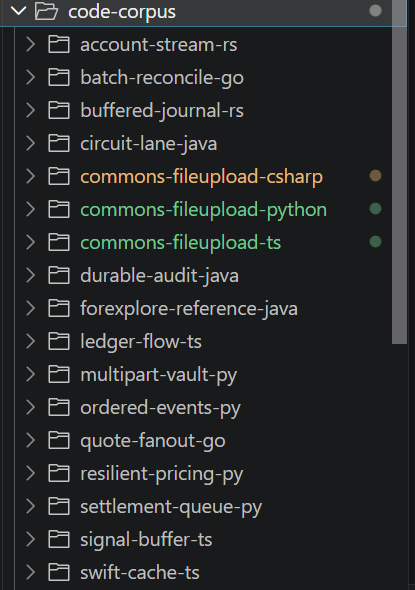

## 实验设置

目标待翻译骨架

Commons-FileUpload 是一个 Java 文件上传组件，主要用于解析 HTTP multipart/form-data 请求，支持普通表单字段和文件上传。它提供流式读取、内存与临时磁盘存储切换、请求/文件大小限制、文件数量限制、MIME 参数解析，以及 Servlet、Portlet 适配。

| 指标 | 数量 |
| --- | --- |
| 生产 Java 文件 | 40 个 |
| 生产源码 LoC（物理行） | 7,043 行 |
| 测试文件 | 20 个 |
| 测试代码 LoC | 3,595 行 |
| 顶层 class | 24 个 |
| 顶层 interface | 10 个 |
| 总顶层类 | 34个 |

### 构建三个语言的平行实现作为Ground Truth
- commons-fileupload - C#
- commons-fileupload - Python
- commons-fileupload-  ts

在对应的类名和注释上做出差异化，例如:

   对象             检索类名                  类摘要开头
  ━━━━━━━━━━━━━━━  ━━━━━━━━━━━━━━━━━━━━━━━━  ━━━━━━━━━━━━━━━━━━━━━━━━━━━━━━━━━━━━━━━━━━━━━━━━━━━━━━━━━━━━━━━━━━━━━━━━━
   Java skeleton    uploadCoordinator         上传组件说明：持有可配置 FileItemFactory 的高层 multipart 解析入口。
  ───────────────  ────────────────────────  ─────────────────────────────────────────────────────────────────────────
   C#               MultipartUploadHandler    C# 上传参考：持有可配置 FileItemFactory 的高层 multipart 解析入口。
  ───────────────  ────────────────────────  ─────────────────────────────────────────────────────────────────────────
   Python           multipart_upload          Python 上传实现：持有可配置 FileItemFactory 的高层 multipart 解析入口。
  ───────────────  ────────────────────────  ─────────────────────────────────────────────────────────────────────────
   TypeScript       fileUploadEngine          TS 上传组件：持有可配置 FileItemFactory 的高层 multipart 解析入口。

代码仓由13个无关仓库+3个groundtruth仓库构成

## 检索

1. 一阶段召回率：99 / 102 = 97.06% 

   `命中的目标类数除以全部参与评测的目标类数。`

2. 最终 Topk(Top4) 召回率：96 / 102 = 94.12%

   `进入 Topk 的目标类数除以全部参与评测的目标类数。`

3. 一阶段命中率：34 / 34 = 100%

   `有多少目标类在第一阶段至少找到了一个可用答案。`

4. 最终 Topk(Top4) 命中率：33 / 34 = 97.06%

   `有多少目标类在最终候选中至少保留了一个正确答案。`

## 翻译&验证

1. 编译通过率：31 / 34 = 91.18%

2. 功能等价率(测试通过率)：44 / 83 = 53.01%

3. 行为等价率(差分测试行为一致)：50%

4. 差分测试覆盖率： 50%

5. 漏洞引入率 -> 待实现

## 复用

1. 端到端"从需求到可复用实现"的工时压缩比 -> 待实现

2. 人工确认率 -> 待实现

## 类级功能等价实验

针对 31 个已通过模块编译门槛的类，新增一组一类三测的行为用例。用例参考 Apache Commons FileUpload 1.5 原实现及其上游 JUnit，覆盖配置往返、元数据、边界输入、异常、状态变化和编码解码；先在原项目验证，再将同一套用例运行到翻译项目。完整清单见 `fixtures/benchmark/commons-fileupload-class-level/manifest.json`。

| 指标 | 结果 |
| --- | ---: |
| 源项目类级测试 | 93 / 93 |
| 翻译项目类级测试用例 | 87 / 93 |
| 功能等价类比例 | 28 / 31 = 90.32% |

每个类固定 3 个 TestCase；只有该类的 3 个用例全部通过，才计为功能等价。未通过的类是 `DefaultFileItem`、`FileItem` 和 `DiskFileItem`，共同失败点是 `DiskFileItem.getOutputStream()` 仍返回 `TODO: create item output stream`。这些失败属于实际行为缺失，不计入通过，也没有把测试标记为“未验证”。
